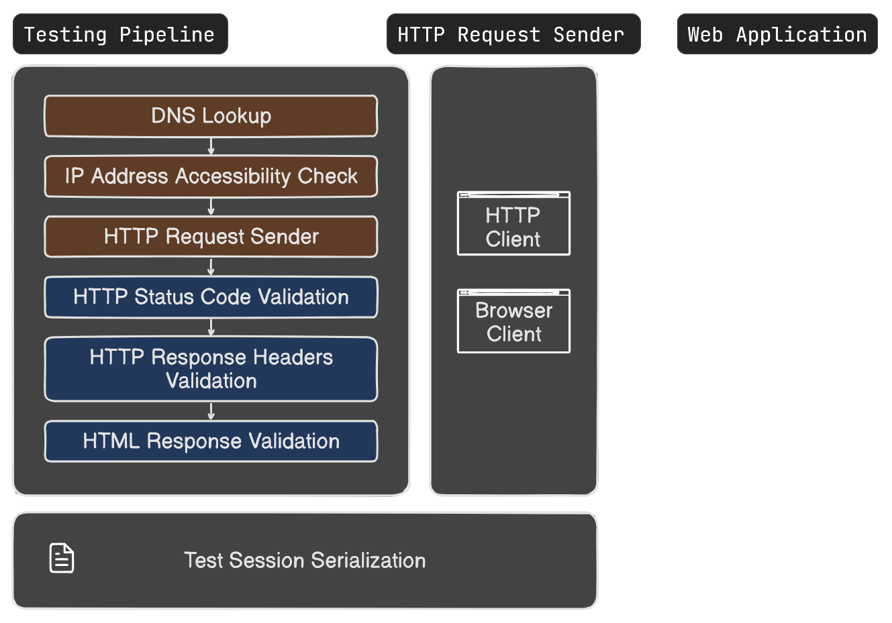

# How does it work?

One of the key features of <b>Xping</b> SDK is its ability to check server availability and the data it returns through a number of action and validation steps. A typical testing pipeline includes the following steps:
 
 

#### DNS lookup: 

Performs a DNS lookup to resolve the domain name of the server to its corresponding IP address. 
 

#### IP address accessibility check: 

Checks whether the IP address of the server is accessible from the client machine.
 

#### Send HTTP request: 

Sends an HTTP request to the server to check whether it is up and running.
 

#### Response validation: 

Validates the response received from the server to ensure that it is valid and contains the expected data. This validation process involves checking various aspects of the response, such as the HTTP status code, the HTTP headers, and the content. By validating the response, Xping can verify that the server is functioning correctly and that the response matches the expected criteria.

The response validation happens on different layers, depending on the type and level of validation required. For example, Xping can perform the following types of validation:

* __HTTP validation__: This layer checks the HTTP protocol aspects of the response, such as the status code, the headers, and the cookies. This can help to ensure that the server is responding with the correct HTTP status (e.g. 200 OK, 404 Not Found, etc.), that the headers are consistent with the request and the content type, and that the cookies are set or updated as expected.
* __Content validation__: This layer checks the content of the response, such as the HTML, JSON, XML, or plain text. This can help to ensure that the response contains the expected data, such as the correct elements, attributes, values, or keywords. Xping can use various methods to validate the content, such as XPath, regular expressions, or custom validators.

 

Whenever any of the above steps fail, __Xping__ makes it easy to find out the root cause of the server issue. This helps developers quickly identify and fix issues with their web applications.

## High Level Overview

Below figure provides a high-level overview of the <b>Xping</b> architecture. 
  

## HTTP Request Sender

Xping uses two mechanisms to run automated tests in its HTTP request system: HttpClient and Headless Browsers.

* [HttpClient](https://learn.microsoft.com/en-us/dotnet/api/system.net.http.httpclient) is a .NET class that provides a high-level abstraction for sending and receiving HTTP requests and responses. It is fast, lightweight, and easy to use. However, it does not process HTML responses or run JavaScript code, which may limit its ability to validate server responses.

* @Xping.Sdk.Core.Clients.Browser.BrowserClient are browsers that run without a graphical user interface, but can still render web pages and execute JavaScript code. They are useful for simulating user interactions and testing dynamic web applications. However, they are slower, heavier, and more complex than HttpClient.

Depending on your testing needs, you can choose either or both of these mechanisms to create and run your HTTP requests with Xping SDK. You can also configure various parameters and options for each mechanism, such as headers, cookies, protocols, timeouts, etc. For more information, see the documentation and examples on how to use HttpClient and Headless Browsers with Xping SDK.

## Test Session Serialization

Test session serialization is a feature that allows users to convert test sessions into a format that can be stored or transmitted. A test session is a class that represents a test execution and its attributes. These include a state, a start date, and a duration that indicate the overall status of the test session, such as completed, failed, or declined. A test session can store various data related to the test operation, such as resolved IP addresses from DNS lookup, HTTP response headers, HTML content, and captured screenshots from the headless browsers. Test session serialization has several benefits, such as:

* Saving and loading test sessions for further analysis and comparison. This can help users to evaluate the performance and quality of their testing activities, as well as to identify the areas that need more testing or improvement.
* Transferring test sessions between different machines or applications. This can help users to share their testing information with other users or tools, as well as to run their tests on different environments or platforms.
* Simplifying the implementation of other features that might require serialization, such as session replication, backup, or migration. This can help users to ensure the reliability and consistency of their testing data, as well as to avoid data loss or corruption.

Test session serialization supports two formats: binary and XML. Users can choose the format that suits their needs and preferences, depending on the size, readability, and compatibility of the data. Users can use the @Xping.Sdk.Core.Session.Serialization.TestSessionSerializer class, which provides two methods to serialize and deserialize test sessions.

Xping test session serialization is a powerful and useful feature that enhances the functionality and usability of the Xping project. It enables users to store, transfer, and manipulate test sessions in a convenient and efficient way.